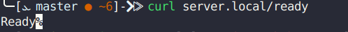
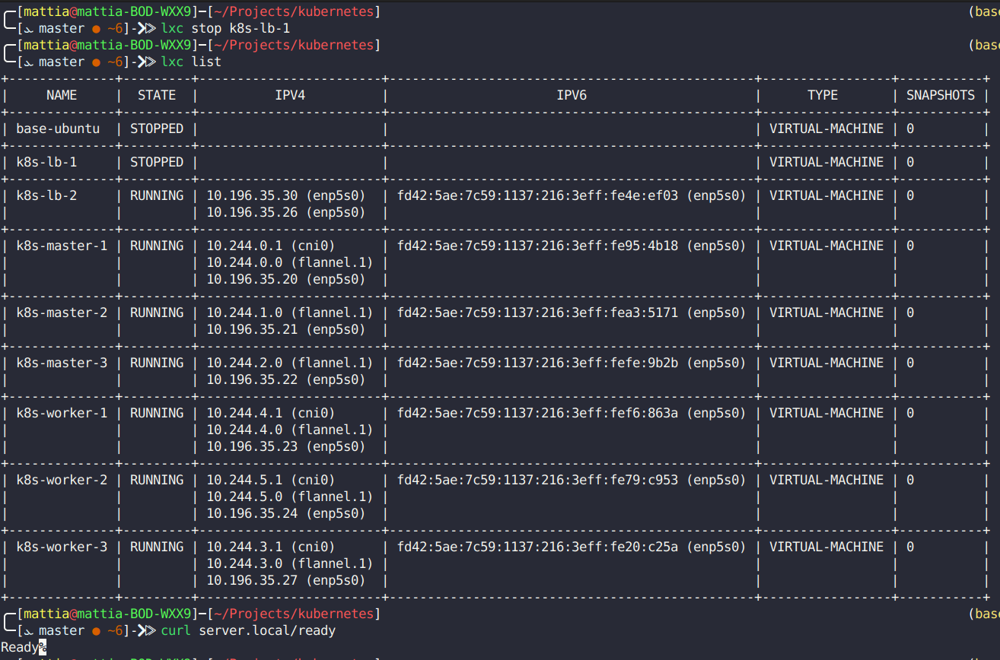
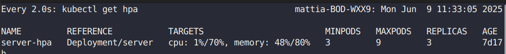

# Esame di Virtualizzazione
## 1. Descrizione del progetto
## 1.1 Descrizione ed obbiettivo
L'obbiettivo di questo progetto è quello di creare un cluster kubernetes production ready, scalabile verticalmente e con high availability (HA). Questo progetto si occupa solamente di dare una soluzione pronta all'uso per la creazione del solo cluster kubernetes, senza quindi occuparsi di ulteriori aspetti sistemistici quali configurazione del Firewall, gestione della DMZ, gestione dei certificati SSL, eccetera. Il cluster che si vuole creare è un cluster che risolva il problema dato da un scenario molto diffuso in ambito aziendale ovvero la gestione in container di un sistema client server sviluppata a micro servizi che sfrutti al meglio le funzionalità che kubernetes offre mantenendo comunque semplice la gestione del cluster. L'applicativo in questione avrà 3 micro servizi:
- applicazione client
- applicazione server
- database

Essendo lo scopo di questo progetto un'architettura high available, saranno presenti più nodi control plane, più worker node e almeno 2 load balancer per accedere ai control plane ed ai worker node. \
Per lo sviluppo di questo progetto sono state usate solamente tecnologie Open Source

### 1.2 Challenge affrontate nel progetto
1. Lo sviluppo di applicazioni orientati ai micro servizi
2. La containerization dei vari applicativo con relativa gestione in cloud tramite un docker hub
3. La creazione di un cluster kubernetes con high availability 
4. L'horizontal pod autoscaling dei micro servizi
5. La gestione di un DB Mysql con high availability (quindi la gestione dello storage condiviso in più nodi in modo da garantire le funzionalità anche in caso di spegnimento di un nodo)
6. Rendere Client e Server disponibile per gli utenti tramite distinti nomi DNS.

### 1.3 Descrizione dell'applicazione containerizzata
L'applicazione containerizzata consiste in:
- applicativo client: Applicazione lato client sviluppata con [React JS](https://github.com/facebook/react), utilizzo di [Nginx](https://github.com/nginx/nginx) come HTTP server.
- applicativo server: Applicazione server sviluppata con [Node JS](https://github.com/nodejs/node) utilizzando il framework [Express JS](https://github.com/expressjs/express).
- database: Database [Mysql](https://github.com/mysql/mysql-server), utilizzo di [Percona operator per Mysql](https://github.com/percona/percona-server-mysql-operator) per rendere Mysql High Available e distribuito su più nodi.
- load balancer: Utilizzo del load balancer [HAProxy](https://github.com/haproxy/haproxy) insieme all'applicativo [Keepalived](https://github.com/acassen/keepalived) per gestire la ridondanza sui load balancer
- strumento di virtualizzazione: Per creare il cluster e renderlo il più simile possible ad un ambiente di produzione si fa uso di macchine linux ubuntu server create tramite il software [LXD](https://github.com/lxc/lxc)

### 1.4 Strumenti per il testing
Per testare la web app sarà sufficiente testare il corretto funzionamento collegandosi dal browser all'URL del client (default client.local, importante aggiungere l'host nel file `/etc/hosts`, facendolo puntare al Virtual IP del load balancer).
Per testare l'horizontal pod autoscaling verrà utilizzato il software [Locust](https://github.com/locustio/locust) perfetto per load e stress testing.
Per testare invece la ridondanza tra i server e quindi il corretto funzionamento dell'high availability cluster basterà spegnere e riaccendere i nodi del cluster in momenti randomici.
Per testare il Database è inoltre presente un Deploy dell'immagine di [PHP My Admin](https://github.com/phpmyadmin/phpmyadmin) (usando phpmyadmin.local come ingress).

## 2. Infrastruttura
### 2.1 Descrizione del Cluster
Per questo progetto è stato scelto di realizzare un cluster kubernetes con high availability quindi con ridondanza di macchine server e con la totale assenza di single point of failure. \
Il cluster è quindi composto da:
- 3 Control Plane: come descritto nella documentazione di Kubernetes, servono almeno 3 nodi control plane per creare un HA cluster. Per avere quorum nel sistema di consenso (etcd) e garantire la disponibilità anche in caso di guasto di un nodo.
- 3 Worker Node: sono stati scelti 3 nodi worker per garantire risorse sufficienti all'esecuzione dei carichi applicativi e per rispettare i requisiti minimi del Percona Operator, che richiede almeno 3 repliche per il corretto funzionamento del cluster database in modalità HA.
- 2 Load Balancer: vengono utilizzati per fornire un punto di accesso unificato al cluster, distribuendo il traffico verso i 3 nodi control plane e bilanciando gli accessi agli ingress delle web app tra i nodi worker. La presenza di due istanze evita un single point of failure; tramite Keepalived viene gestito un IP virtuale condiviso, che garantisce continuità di accesso al cluster anche in caso di guasto di uno dei due load balancer.

## 2.2 Diagramma del cluster


## 3. Implementazione

### 3.1 Sviluppo di applicazioni orientate ai micro servizi
Per utilizzare al meglio kubernetes e le sue funzionalità è preferibile sviluppare applicazione orientate ai micro servizi, per ottenere questo risultato ho creato 2 progetti distinti per client e server (in modo da poterli scalare singolarmente). \
Inoltre, sempre per poter sfruttare al meglio lo scaling e la possibilità di distribuire i pod di una stesso micro servizio su nodi diversi, ho sviluppato sia l'applicativo client che l'applicativo stateless per non avere problemi di session in memoria o di storage condivisi. \
Per quanto riguarda MySQL, invece, ho scelto di utilizzare il Percona Operator per MySQL che gestisce automaticamente la creazione di un cluster database altamente disponibile, con replica sincrona e failover automatico, facilitando così la gestione e la resilienza del database all'interno dell'ambiente Kubernetes.

### 3.2 Containerizzazione dei micro servizi
Ogni micro servizio ha la sua immagine creata tramite DockerFile che esegue la build del micro servizio e poi lo espone tramite una porta.
Queste immagini vengono successivamente pushate sul docker hub (un docker hub pubblico in questo caso) per poi essere pullate da kubernetes.
Entrando nella cartella di ogni progetto è possibile trovare il DockerFile contenente le istruzione per creare l'immagine del container.

### 3.3 Creazione del cluster kubernetes con High Availability
Come CNI del cluster è stato utilizzato [Flannel](https://github.com/flannel-io/flannel). \
Per creare un cluster Kubernetes con high availability è necessario avere almeno 3 nodi control plane, questo rende possibile il funzionamento delle attività che deve svolgere il control plane anche in caso di rottura di uno dei 3 nodi. Questo è possibile perché la sincronizzazione dei nodi si basa su un sistema di consenso (etcd) che richiede una maggioranza (quorum) per garantire coerenza e disponibilità: con 3 nodi, il cluster può tollerare la perdita di uno di essi mantenendo il controllo operativo senza rischiare inconsistenze o interruzioni. \
I load balancer vengono configurati per distribuire il traffico verso l’3. API server sui 3 nodi control plane, oltre a gestire il bilanciamento delle richieste HTTP e HTTPS (porte 80 e 443) inoltrate ai service NGINX Ingress presenti sui nodi worker.

### 3.4 Horizontal pod autoscaling
Viene utilizzato l'Horizontal Pod Autoscaling (HPA) per monitorare dinamicamente il carico di lavoro sull’applicazione server e adattare automaticamente il numero di pod in esecuzione. In questo modo, il sistema è in grado di scalare orizzontalmente le risorse in base al volume delle richieste ricevute, garantendo prestazioni ottimali anche in caso di picchi di traffico e ottimizzando l’utilizzo delle risorse del cluster. \
Per rendere possibile ciò è stato inoltre installato il metric server.

### 3.5 High Availability con Mysql
Per garantire HA con MySQL ho utilizzato il Percona Operator per MySQL, una soluzione che permette la creazione di un cluster MySQL distribuito e resiliente. Il Percona Operator automatizza la creazione e il failover del database, assicurando che i dati siano sempre sincronizzati tra i nodi e che il sistema continui a funzionare anche in caso di guasto di uno o più nodi. Per lo storage persistente ho scelto Rancher come storage provisioner, che fornisce volumi dinamici.

### 3.6 Creazione degli ingress
Per permettere l’accesso alle applicazioni client e server tramite domini personalizzati, ho configurato gli Ingress nel cluster Kubernetes. Utilizzando il controller NGINX Ingress, ho creato regole che instradano il traffico verso i rispettivi servizi in base ai domini client.local e server.local.

## 4 Simulazione

### 4.1 Setup macchine virtuali
 \
Per eseguire questa simulazione verranno impiegate 8 macchine virtuali così distribuite:
- 2 load balance (`k8s-lb-1`, `k8s-lb-2`)
- 3 kubernetes control plane (`k8s-master-1`, `k8s-master-2`,`k8s-master-3`)
- 3 kubernetes worker (`k8s-worker-1`, `k8s-worker-2`, `k8s-worker-3`)

Inoltre ad ognuna delle macchine virtuali è stato assegnato un indirizzo IP fisso (che corrisponde a quello mostrato in figura).
Su ogni macchina è stato configurato un server ssh e sono stati installati i programmi necessari per il cluster kubernetes quali:
- kubeadm, kubectl, kubelet
- containerd (per la gestion dei container)

Si può inoltre notare che il nodo `k8s-lb-1` ha 2 indirizzi IP configurati sulla stessa interfaccia di rete in quanto è la macchina che di default contiene l'indirizzo IP locale assegnatogli da keepalived ovvero l'indirizzo IP `10.196.35.30`. \
Questo indirizzo IP sarà di particolare importanza in quanto è quello indicato come `control-plane-endpoint` al momento della creazione del cluster, il nodo `k8s-lb-1` ogni volta che gli arriva una richiesta sulla port 6443 (porta di default del kubernetes api server) la reindirizzera ad uno dei nodi control plane tramite un server haproxy appositamente configurato (vedere la cartella load_balancer per accedere a degli esempi dei file di configurazione di keepalived e di haproxy usati su lb-1 e lb-2). \
Per quanto riguarda il CNI è stato usato Flannel, in quanto è un plugin semplice da configurare e ben integrato con Kubernetes, che non richiede configurazioni di rete complesse. \
Il cluster è stato creato tramite il seguente comando eseguito sul nodo `k8s-master-1` (usando come `pod-network-cidr` quello di default di Flannel)
```sh
kubeadm init --control-plane-endpoint "10.196.35.30:6443" \
  --upload-certs \
  --pod-network-cidr=10.244.0.0/16 
```

Per rendere più semplice l'interazione con il cluster ed il successivo testing degli Ingress di kubernetes ho assegnato ad ogni host un nome usando, in ambiente debian,il file `/etc/hosts` come mostrato nella seguente immagine.
 

### 4.2 Setup del cluster
Una volta creato il cluster, è stato subito aggiunto Flannel seguendo la documentazione ufficiale di Github ([Deploying Flannel with kubectl](https://github.com/flannel-io/flannel?tab=readme-ov-file#deploying-flannel-with-kubectl)). \
Successivamente alla creazione del cluster è stato utilizzato il comando kubeadm join (fornito dall'output del comando kubeadm init) sui vari nodi per aggiungere control plane e worker node. \
Per permettere il funzionamento degli Ingress e dell'horizontal pod autoscaler ho applicato i necessari manifesti .yaml reperibili dalle documentazioni ufficiale dei servizi necessari ([metric server](https://kubernetes-sigs.github.io/metrics-server/), [nginx ingress](https://github.com/kubernetes/ingress-nginx)) (situati della cartella k8s/cluster-only). \
Per quanto riguarda il database viene utilizzato il Percona Operator per Mysql, bisogna quindi applicare correttamente i relativi manifesti .yaml reperibile dalla [guida ufficiale](https://docs.percona.com/percona-operator-for-mysql/pxc/kubectl.html#prerequisites) (situati nella carella k8s/percona-operator, i manifesti verranno applicati sotto il namespace percona-operator). \
Infine rimangono da applicare i manifesti dei servizi client, server e phpMyAdmin (non possiede HA è solo a scopo di test) situati nella cartella k8s/default
La seguente immagine mostra gli output dei comandi una volta che il cluster è stato correttamente configurato


### 4.3 Descrizione dei manifesti
Il sistema è composto da tre principali componenti deployati in Kubernetes: client, server, e phpMyAdmin, ciascuno definito tramite Deployment, Service e Ingress. Il client è una web app con 3 repliche e policy anti-affinità per distribuirne i pod tra i nodi. È accessibile tramite l’host client.local. Il server, anch’esso con 3 repliche e anti-affinità, espone un’API sulla porta 3000, configurata tramite ConfigMap e Secret, e include probe di liveness e readiness. È bilanciato dinamicamente tramite un HorizontalPodAutoscaler (HPA) tra 3 e 9 repliche, in base all’utilizzo di CPU e memoria. L'interfaccia phpMyAdmin consente l’accesso al database e viene esposta su phpmyadmin.local. La configurazione dell’ambiente e delle credenziali è separata tramite oggetti ConfigMap e Secret, garantendo modularità e sicurezza. Tutti i servizi interni usano ClusterIP, e l’accesso esterno è gestito da un Ingress NGINX.
Per far funzionare correttamente gli ingress NGINX i 2 load balancer faranno un load balancing tra i 3 worker node servendo alla porta 80 del load balancer le porte esposte dal service dell'ingress, quindi i servizi web saranno accessibili tramite i load balancer e quindi tramite l'IP virtuale sopra descritto.

### 4.4 Test del cluster
Per testare il cluster ci sono diversi modi, il migliore è accedere all'url `http://client.local`, creare un account ed accedere alla dashboard, questo permette di controllare il corretto funzionamento di Ingress, client, server e database, ricoprendo completamente lo use case di questa applicazione. \
Per semplicita in questa simulazione testeremo la correttezza del cluster tramite un route del server che accede al Database, questo ci permette di testare Ingress, server e database che ricoprono una buona parte degli elementi da testare e rendere facile e veloce avere un riscontro visivo del funzionamento corretto del cluster. \
Testiamo quindi che il cluster funzioni 

### 4.5 Test HA sul load balancer
Ora testeremo il corretto funzionamento dell'high availability su varie parti del cluster spegnendo a runtime alcune macchine virtuali.
Il primo test lo faremo sui load balancer: spegneremo il load balancer 1 che è quello che attualmente detiene l'IP virtuale e vedremo se il load balancer 2 prenderà correttamente l'ip virtuale.
 \
Come dimostrato dall'immagine il load balancer 2 detiene correttamente l'ip virtuale 10.196.35.30 ed il cluster continua a funzionare correttamente.

### 4.6 Tets HA sul control plane
Ora proveremo a spegnere il nodo master 1 ovvero uno dei control plane e testeremo che il cluster continui a funzionare correttamente in quando l'etcd server dovrebbe continuare ad avere il quorum di 2 nodi su 3 votanti.


### 4.7 Test HA sul un worker node
Ora proveremo a spegnere il nodo worker 1 ovvero un nodo worker e testeremo che il cluster continui a funzionare correttamente in quanto Percona XtraDB Cluster che utilizza il galera cluster (libreria di replicazione sincrona multimaster) continua ad avere il quorum di 2 nodi con Percona XtraDB Cluster attivi su 3.


### 4.8 Test HA sul secondo control plane
Ora proveremo a spegnere il nodo master 3 ovvero un altro dei control plane, in questo caso il cluster resterà attivo ma in stato degradato in quanto l'etcd perde il quorum e non potrà più accettare modifiche allo stato del cluster ma i workload esistenti continueranno a girare.


### 4.9 Test horizontal pod autoscaling
La prossima simulazione è volta a testare il corretto funzionamento dell'horizontal pod autoscaler, in questo cluster l'hpa è applicato solamente sul server a scopo dimostrativo, inizialmente possiamo notare che se nessuno fa chiamate al server i suoi livelli di CPU e memoria sono bassi e quindi il numero di pod è al minimo

Iniziamo il testing facendo partire Locust e utilizzando la route stress sul server che aspetta 2 secondi e poi risponde. \

Possiamo subito notare che dopo un po' di tempo in cui locust è in esecuzione subito il numero di POD arriva a 5.

Continuiamo quindi il test aumento il numero di utenti attivi e quindi di richieste simultanee su locust

Notiamo che dopo un po' di tempo il numero di pod che kubernetes schedula sale subito al massimo

Una volta stoppato locust possiamo poi notare che lentamente il numero di pod cala fino a tornare al minimo di 3.
Abbiamo quindi verificato il corretto funzionamento dello scaling basato sulle risorse